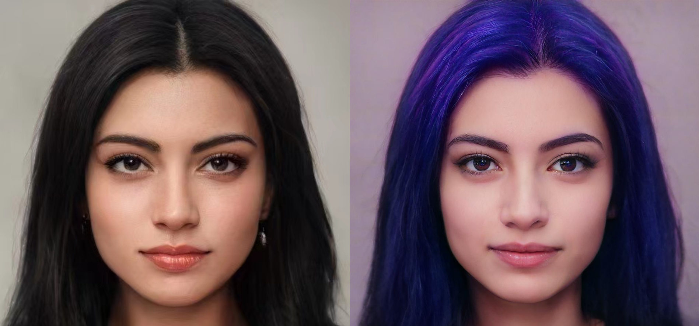
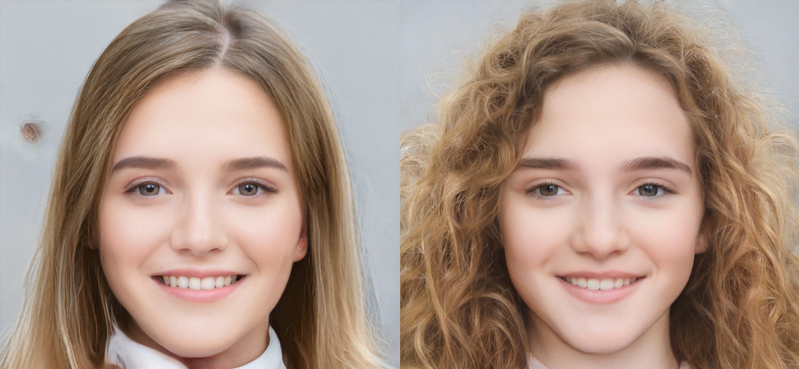

# Web page project based on StyleClip
### Web

The Web page project is available at www.wqyai.cn.(The web now is currently inactive because of the cloud server) Welcome to visit my website to enjoy the fun of editing pictures.:laughing:

### Environment

To run the code, you can run the following commands to download the required packages.

```
conda install --yes -c pytorch pytorch=1.7.1 torchvision
pip install ftfy regex tqdm gdown flask onnx onnxruntime
pip install dlib==19.6.1
```

### Pre-trained model 

The repository uploaded the code used by the front and back end of the web page, but the pre-trained model at runtime was not uploaded. When you run the project code, you need to download the pre-trained model at the link below.

##### Pre-trained models for specific editing effects:

| File name         | Download link                                                |
| ----------------- | ------------------------------------------------------------ |
| angry.pt          | https://drive.google.com/uc?id=1g82HEH0jFDrcbCtn3M22gesWKfzWV_ma |
| surprised.pt      | https://drive.google.com/uc?id=1F-mPrhO-UeWrV1QYMZck63R43aLtPChI |
| bowlcut.pt        | https://drive.google.com/uc?id=1xwdxI2YCewSt05dEHgkpmmzoauPjEnnZ |
| curly_hair.pt     | https://drive.google.com/uc?id=1xZ7fFB12Ci6rUbUfaHPpo44xUFzpWQ6M |
| purple_hair.pt    | https://drive.google.com/uc?id=14H0CGXWxePrrKIYmZnDD2Ccs65EEww75 |
| beyonce.pt        | https://drive.google.com/uc?id=1KJTc-h02LXs4zqCyo7pzCp0iWeO6T9fz |
| depp.pt           | https://drive.google.com/uc?id=1FPiJkvFPG_y-bFanxLLP91wUKuy-l3IV |
| hilary_clinton.pt | https://drive.google.com/uc?id=1X7U2zj2lt0KFifIsTfOOzVZXqYyCWVll |
| taylor_swift.pt   | https://drive.google.com/uc?id=10jHuHsKKJxuf3N0vgQbX_SMEQgFHDrZa |
| trump.pt          | https://drive.google.com/uc?id=14v8D0uzy4tOyfBU3ca9T0AzTt3v-dNyh |
| zuckerberg.pt     | https://drive.google.com/uc?id=1NjDcMUL8G-pO3i_9N6EPpQNXeMc3Ar1r |
| afro.pt           | https://drive.google.com/uc?id=1i5vAqo4z0I-Yon3FNft_YZOq7ClWayQJ |

*Note: The above model should be downloaded and placed in the `Project/notebook/mapper/pretrained`*.

##### Pre-trained models for encoder and generator:

| File name                  | Download link                                                |
| -------------------------- | ------------------------------------------------------------ |
| e4e_ffhq_encode.pt         | https://drive.google.com/file/d/1cUv_reLE6k3604or78EranS7XzuVMWeO/view?usp=sharing |
| stylegan2-ffhq-config-f.pt | https://drive.google.com/file/d/1EM87UquaoQmk17Q8d5kYIAHqu0dkYqdT/view?usp=sharing |

*Note: The above model should be downloaded and placed in the `Project/pretrained_models`*.

### Run the code
```python
python start.py
```

**The code of the project is based on the following code on github.**

- [orpatashnik/StyleCLIP: Official Implementation for "StyleCLIP: Text-Driven Manipulation of StyleGAN Imagery" (ICCV 2021 Oral) (github.com)](https://github.com/orpatashnik/StyleCLIP)

- [pbaylies/stylegan-encoder: StyleGAN Encoder - converts real images to latent space (github.com)](https://github.com/pbaylies/stylegan-encoder)

- [omertov/encoder4editing: Official implementation of "Designing an Encoder for StyleGAN Image Manipulation" (SIGGRAPH 2021) https://arxiv.org/abs/2102.02766 (github.com)](https://github.com/omertov/encoder4editing)

  

### Examples

Here are some good examples of using the Web page.




